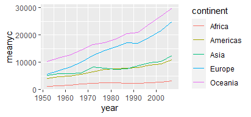

## Ideas básicas de R

1. Trabajamos sobre objetos

2. Los objetos hay que nombrarlos

3. Sobre los objetos aplicamos funciones. Estas las podemos crear o podemos usar las que otros han creado. 

Se dará cuenta que la sintaxis sigue una estructura. Eso es como aprender a hablar, uno sigue unas reglas gramaticales aún si no sabe cuales son esas reglas. Puro conocimiento tácito. La experiencia es lo que nos dá la maestría. 

## ¿Datos?

Los datos pueden entenderse como una colección de valores, los cuales pueden ser números, caracteres, simbolos. Los datos no son en si mismos información. Los datos son información si le dicen algo a alguien. Provee una respuesta a una pregunta. El usuario de esta información la transforma en conocimiento a través de la experiencia y la interpretación. Suponga que usted tiene lo siguiente en su hoja de cálculo

```{r, warning=FALSE, message=FALSE}
library(flextable)
Día<-c("Lunes")
Valor<-c(31)
Unidad<-c("Celsius")
df<-data.frame(Día,Unidad,Valor)
myft<-flextable(df)
bft<-bold(myft,i=1, part="header")
bft<-theme_zebra(bft)
bft
```

Los valores y caracteres que tiene allí son datos, que se convierten en información cuando se organizan para concluir que el lunes la temperatura fue de 31 grados celsius. 


### Señal y ruido 


Ahora, no todos los datos son útiles, y no siempre tener más datos significa tener más y mejor información. Lo que nos interesa es tener más señal y menos ruido. Cuando usted está en su clase remota por alguna plataforma escucha la voz del profesor, el pregón del vendedor de frutas, la maldición del vecino, el ventilador/abanico, en fin. Si a usted le interesa realmente la clase, la señal es la voz del profesor, lo demás es ruido. Si el propósito de los datos es informarnos para incitar la acción o la inacción, entonces el ruido es lo que debemos ignorar. 

Son datos aleatorios, inútiles para algún propósito. Como regla general, entre más datos mire más ruido consume. La razón ruido a señal se incrementa. En la vida real no queremos tomar decisiones basados en ruido. 

```{r, warning=FALSE, message=FALSE, results='hide'}
library(quantmod)
start<-as.Date("2007-01-01")
end<-as.Date("2021-09-02")

getSymbols("BZ=F",src="yahoo", from=start, to=end)


```

```{r}
library(dygraphs)
brentd<-dygraph(`BZ=F`[,"BZ=F.Close"],main="Brent-precio de cierre (USD)-Diario")
brentd
```


```{r}

brentm<-apply.monthly(`BZ=F`,mean, na.rm=TRUE)
dygraph(brentm[,"BZ=F.Close"],main="Brent-precio de cierre (USD)-Mensual")
```

```{r}
brenty<-apply.yearly(`BZ=F`,mean, na.rm=TRUE)
dygraph(brenty[,"BZ=F.Close"],main="Brent-precio de cierre (USD)-Anual")

```

Si usted observa datos del precio del petróleo, Brent, en frecuencia anual el ratio señal a ruido digamos que es uno a uno. La mitad de lo que observa es variabilidad aleatoria. Si los datos los observa a frecuencia mensual, entonces usted podría tener 70% de ruido y 30% de señal, mientras que si los mira a frecuencia diaria el 95% es ruido. A frecuencia diaria usted tiene más datos, pero ciertamente no tiene más capacidad para entender el comportamiento de largo plazo del precio del petróleo. Más no siempre es mejor. 

Para una buena discusión sobre el ruido y la señal se recomienda la siguiente lectura [The noise bottleneck: when more information is harmful](https://fs.blog/2012/05/noise-and-signal-nassim-taleb/)

<br/>

### Tipos de objetos

<br/>

R Funciona sobre objetos. Los objetos tienen atributos. Unos son más complejos que otros. Lo que podemos hacer con cada objeto depende de sus atributos. En una silla se sienta, en una butaca también, pero quizás la silla es mejor para trabajar en el escritorio.

<br/>

#### Vectores atómicos

Es un vector de datos. Veamos

```{r}
dado<-c(1,2,3,4,5,6)
diez<-c(10)
asistentes<-c("pedro","juan","diana","helena")
nota<-c(3.1,4.2,4.5,3.8)

```

<br/>

Usted puede hacer operaciones sobre los datos contenidos en el vector, y crear nuevos objetos basado en las operaciones realizadas

```{r}
mean(nota)
promedio<-mean(nota)
```

<br/>

Si los vectores tienen la misma longitud, entonces puede unirlos

```{r}
curso<-cbind(asistentes,nota)
print(curso)
```

<br/>

#### Data Frame

Es un arreglo de datos de dos dimensiones en forma matricial. Si ha trabajado con bases de datos, esto le será familiar

```{r}
df<-data.frame(curso)
class(df$asistentes)
class(df$nota)
```

<br/>

Cada columna del data frame es un objeto. Objetos dentro de objetos. En el lenguaje de "base de datos" cada columna sería nuestra variable y cada fila las observaciones. Podemos crear nuevos objetos dentro del data frame

```{r}
df$nota<-as.numeric(df$nota) # convertimos de character a numeric
df$lnota<-log(df$nota)
```


### Tipos de datos

Analizar los datos no es otra cosa que manipularlos para extraer información de ellos. Las manipulaciones posibles dependen, obviamente, del tipo de datos que tengo. Considere la siguiente base de datos

```{r, warning=FALSE, message=FALSE}
library(flextable)
Raza<-c("Doberman","Criollo","Bulldog","Collie")
Peso<-c(28.5,19.2,31.4,23.6)
Sexo<-c("Hembra","Hembra","Hembra","Macho")
Puesto<-c(2,1,4,3)
perros<-data.frame(Raza,Peso,Sexo,Puesto)
perrosft<-flextable(perros)
perrosft<-bold(perrosft,i=1, part="header")
perrosft<-theme_zebra(perrosft)
perrosft
```

En ella usted tiene las características de los perros que participaron en una carrera de 200m en el parque cercano a su casa ¿Qué puedo hacer con cada una de ellas?

- Raza: es una categoría. Me sirve para diferenciar a un perro de otro

- Peso: es una medición del peso del animal, su unidad de medida es kg. Es numérica. Tiene sentido decir que el Bulldog es 1.63 veces más pesado que el Criollo. Puedo decir que el peso promedio de los perros que participaron en la competencia es de 25.67 kg

- Puesto: es ordinal. Puedo ordenar los perros por orden de llegada. Podría decir que el criollo es el perro más rápido y que el Bulldog es el más lento. No puedo decir cuánto más rápido es un perro en relación a otro. Aunque la variable está expresada en números y por lo tanto podría calcular el promedio, 2.5, esto no tiene sentido

Esto es solo el principio, podriamos seguir con diferentes categorizaciones. En cualquier caso, el mensaje es simple. Conozca los datos, examine las variables. El computador puede hacer cálculos complejos, pero no es responsabilidad del computador decidir si tiene sentido la operación realizada

En el mundo del *machine learning* también se habla de datos estructurados y no estructurados. Nosotros trabajaremos con los primeros. 


### Comunicar los hallazgos

Los datos los analizamos para responder a una pregunta. Comunicar lo que hallamos es tan importante como el rigor para llegar al hallazgo. Si no comunica bien no persuade, no incita a la acción. Haremos énfasis en la comunicación visual. Como dice el dicho, "la comida entra por los ojos". Usaremos ggplot2 para casi todas nuestras tareas de visualización. Es realmente poderoso para producir visualizaciones llamativas. 

### Demostración ^[Ejemplo basado en https://raw.githack.com/uo-ec607/lectures/master/01-intro/01-Intro.html#1 Gracias a Grant McDermot por compartir el material ]

#### Ingreso per cápita y expectativa de vida

Queremos saber como es la relación entre el ingreso promedio por persona en un país y la expectativa de vida al nacer. Nuestro análisis es exploratorio. 

Para ello vamos a trabajar con los datos que vienen en la libreria *gapminder*

```{r,message=FALSE,warning=FALSE}
library(gapminder)
library(ggplot2)
gapminder

```

Tenemos datos de expectativa de vida al nacer, población e ingreso per cápita, medido en [dólares internacionales de 2011](https://datahelpdesk.worldbank.org/knowledgebase/articles/114944-what-is-an-international-dollar),  a nivel de país cada 5 años. Los datos son un objeto tipo [tibble](https://tibble.tidyverse.org/)


```{r}
class(gapminder)
```

Empecemos explorando la relación entre la expectativa de vida al nacer y el PIB Per capita

```{r}
plot_1<-ggplot(gapminder,aes(x=gdpPercap,y=lifeExp))+geom_point()
plot_1
```

¿Qué puede decir? Escriba acá su interpretación de esta gráfica


Veamos si hay alguna diferencia por continentes

```{r}
plot_2<-ggplot(gapminder,aes(x=gdpPercap,y=lifeExp,color=continent))+geom_point()+
  xlab("PIB Per cápita (Int. dollars, 2011)")+ylab("Expectativa de vida al nacer (años)")
plot_2
```

La relación parece ser no lineal. Veamos

```{r}
plot_3<-plot_1+geom_smooth(method="loess")+xlab("PIB Per cápita (Int. dollars, 2011)")+ylab("Expectativa de vida al nacer (años)")
plot_3
```

Loess es por "Locally weighted smoothing". Este es un algoritmo no paramétrico cuyo proppósito es recuperar la señal en una muestra de datos ruidosa

**Ejercicio**

En el siguiente chunk realice la suavización loess para plot_2

```{r}
# Escriba acá su código

```


¿Por qué la diferencia en la suavización?

Comparelo con el resultado que arroja el siguiente código ¿Dónde está la diferencia?

```{r}
plot_5<-ggplot(gapminder,aes(x=gdpPercap,y=lifeExp))+geom_point(aes(color=continent))+
  xlab("PIB Per cápita (Int. dollars, 2011)")+ylab("Expectativa de vida al nacer (años)")+
  geom_smooth(method="loess")
plot_5
```

Calculemos el ingreso per cápita promedio por año

```{r,message=FALSE,warning=FALSE}
library(dplyr)
meany<-gapminder%>%group_by(year)%>%summarise(meany=mean(gdpPercap))%>%ungroup
meanyft<-flextable(meany)
meanyft
```

**Ejercicio**

1. Calcule el ingreso per cápita promedio por año por continente

2. Use ggplot con geom_line() para crear la siguiente gráfica


```{r,echo=FALSE,out.width='80%', fig.align='center', fig.cap='...'}


```


